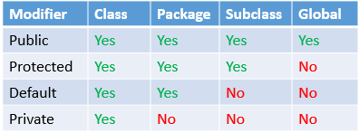
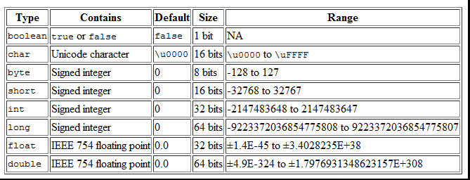

# OOP questions

## Software design

### Error handling

#### What does 'fail fast' mean in terms of exception handling? Why is it a good practice?

    When a problem occurs, it fails immediately and visibly. If something unusually or unexpectedly occurs,
    let the software fail immediately instead of postponting the failure or working around the failure.
    The fail fast principle stands for stopping the current operation as soon as any unexpected error occurs.
    
    Why Fail-Fast?
    - Bugs are earlier to detect, easier to reproduce and faster to fix.
    - It’s faster to stabilize softwares.
    - Fewer bugs and defects will go into production.
    - The cost of failures and bugs are reduced.

## Computer Science

### Data structures

#### How to find the middle element of singly linked list in O(n)?

    Create a pointer at the head of the list, and iterate over the list, until the end to find the length,
    then point at the end again. Get the linked element length/2 times.

#### Given an array of integers going from 1 to 100 (both inclusive) there is a duplicated entry. How to find it?

    We sort the array and then we compare each element to the previous element.
    If the next element is not higher than the previous there is the duplication.
    OR
    We store each element in a set as we iterate over the array,
    before saving a new element we simply check if it's already in the set.

#### What is a linked list? How to find if a linked list has a loop?

    A linked list has an element called the head, and a method with which you can reach to another element.
    if you declare the head element to an outer variable and iterate through the list, you can check if the current element is the same as the one declared.
    If the list comes to an end, it doesn't have a loop.

#### What is the Big O time complexity of the common operations in an ArrayList, LinkedList, HashMap? And of a bubble sort, quicksort, finding items in a Binary Search tree?

    ArrayList:
    - Adding to the beginning (or near the beginning): the whole list needs to be "re-indexed": O(n)
    - Adding to the end (or near to the end): O(1)
    - Remove from the end: O(1)
    - Remove from elsewhere: "re-indexing": O(n)
    - Get (by index): O(1)
    - Contains: O(n)

    LinkedList:
    - Adding to the beginning or end: O(1)
    - Adding elsewhere (somewhere middle): O(n)
    - Remove: O(n)
    - Get: O(n)
    - Contains: O(n)
    
    HashMap:
    - Every task takes a single operation (except in edge cases, like hash clash).
    - Bubble Sort: -needs a nested for loop: O(n^2)

    Quicksort:
    - On average: O(log n)
    - Worst case: O(n^2)

    Binary Search Tree:
    - O(log n)
    - Worst case (degenerate tree): O(n)

#### How does HashMap work?

    It is a data structure which allows us to store object and retrieve it in constant time O(1) provided we know the key.
    In hashing, hash functions are used to link key and value in HashMap.
    Objects are stored by calling put(key, value) method of HashMap and retrieved by calling get(key) method.
    HashMap internally stores mapping in the form of Map. Entry object which contains both key and value object.
    When you want to retrieve the object, you call the get() method and again pass the key object.

#### Why is it important for keys in a map to have an immutable type? (Consider String for example.)

    Key’s hash code is used primarily in conjunction to its equals() method, for putting a key in map and then searching it back from map.
    So if hash code of key object changes after we have put a key-value pair in map, then its almost impossible to fetch the value object back from map.
    It is a case of memory leak. To avoid this, map keys should be immutable.

### Database

#### How can you connect your application to a database server? What are the possible ways?

    You could use REST, and await response. Behind the backend we can create a connection to the server,
    get data by executing an sql command, get(or not) a return value, and close the connection.

    DataSource dataSource = connect();

    private DataSource connect() throws SQLException {
        PGSimpleDataSource dataSource = new PGSimpleDataSource();
        String dbName = System.getenv("DB_NAME");
        String user = System.getenv("USER_NAME");
        String password = System.getenv("PASSWORD");

        dataSource.setDatabaseName(dbName);
        dataSource.setUser(user);
        dataSource.setPassword(password);

        System.out.println("Trying to connect");
        dataSource.getConnection().close();
        System.out.println("Connection ok.");

        return dataSource;
    }

#### What do you know about database normalization?

    Normalization entails organizing the columns (attributes) and tables (relations) of a database to ensure that their dependencies are properly enforced by database integrity constraints.
    It is accomplished by applying some formal rules either by a process of synthesis (creating a new database design) or decomposition (improving an existing database design).

### Other

#### What is a garbage collector, in a nutshell?

    Automatic garbage collection is the process of looking at heap memory, identifying which objects are in use and which are not, and deleting the unused objects.
    An unused object, or unreferenced object, is no longer referenced by any part of your program. So the memory used by an unreferenced object can be reclaimed.
    Garbage Collection tracks each and every object available in the JVM heap space and removes unused ones. 

## Programming paradigms

### Procedural

#### What is casting? What is the difference between up vs downcasting?

    Casting is when you force an object to be of another reference type.

    Animal animal = new Dog();
    Downcasting:  Dog castedDog = (Dog) animal;
    Up: Animal animal = (Animal) animal

    Upcasting is casting to a supertype, while downcasting is casting to a subtype. Upcasting is always allowed,
    but downcasting involves a type check and can throw a ClassCastException.

    Downcasting would be something like this:
        # Animal animal = new Dog();
        # Dog castedDog = (Dog) animal;
    In this case, the cast is possible because at runtime animal is actually a Dog even though the static type of animal is Animal.

    However, if you were to do this:
        # Animal animal = new Animal();
        # Dog notADog = (Dog) animal;
    You'd get a ClassCastException. The reason why is because animal's runtime type is Animal,
    and so when you tell the runtime to perform the cast it sees that animal isn't really a Dog and so throws a ClassCastException.

#### Which order should we catch the exceptions? Why?

    When catching exceptions you want to always catch the most specific first and then the most generic (as RuntimeException or Exception).
    So we and the program know what went wrong exactly.

### Object-oriented

#### What is a class?

    A class describes what the object will be, but it is separate from the object itself. 
    A class is a template for objects that share similar behaviours/properties.

    (The first step is to define the class, which then becomes a blueprint for object creation.
    Each class has a name, and each is used to define attributes and behavior.)

#### What is an object?

    An object is an instance of a class, through which we can call methods and can handle data on an instance basis.
    An object stores its state in fields and exposes its behavior through methods.

#### What is a constructor?

    Constructor of a class is a method which runs on instantiation. It is the first method to run.
    
    If we need of initializing an object in different ways. This can be done using constructor overloading.
    Overloaded constructor is called based upon the parameters specified when new is executed.
    If we want to have different ways of initializing an object using different number of parameters, then we must do constructor overloading.

#### Do we require parameter for constructors?

    We can require parameters, but it is not compulsory.
    Typically, the constructor initializes the fields of the object that need initialization.

#### What is an interface?

    It is an uninstantiable class that has method signatures in it, which must be implemented by the class that implements it.

#### What are access modifiers?

    public, protected, private -these are keywords that regulates which classes see the methods, variables.
    
    # Default – No keyword required: When no access modifier is specified for a class, method or data member.
        It is said to be having the default access modifier by default. Having default access modifier are accessible only within the same package.

    # Private - The methods or data members declared as private are accessible only within the class in which they are declared.
        Any other class of same package will not be able to access these members.
        Top level Classes or interface can not be declared as private, they apply only to nested classes.
    
    # Protected: The methods or data members declared as protected are accessible within the same package or sub classes in different packages.

    # Public: The public access modifier has the widest scope among all other access modifiers.
        Classes, methods or data members which are declared as public are accessible from everywhere in the program. There is no restriction on the scope of a public data members.

#### What is data hiding?

    Encapsulation is a central design principle of OOP. It means that the internal structure and the implementation of a class should be hidden from the world.
    This can be done by restricting the access to these parts.
    Every Object Oriented language provides access modifiers to set the visibility of classes and its members (fields, constructors, and methods) separately.
    This is called data hiding.    

#### Can a static method use non-static members?

    No, it wouldn't make sense because a static method runs the same no matter of outside variables value.
    The static modifier is used for creating static class methods and variables. The keyword static lets a method run without any instance of the class.
    A static method belongs to the class, so there’s no need to create an instance of the class to access it.

#### What is the difference between hiding a static method and overriding an instance method?

    # Instance Methods
    An instance method in a subclass with the same signature and return type as an instance method in the superclass overrides the superclass's method.
    This ability of a subclass (to override a method) allows a class to inherit from a superclass and modify behaviour as needed.
    The overriding method has the same name, number and type of parameters, and return type as the method that it overrides.
    An overriding method can also return a subtype of the type returned by the overridden method. This subtype is called a covariant return type.

    # Static Methods
    If a subclass defines a static method with the same signature as a static method in the superclass,
    then the method in the subclass hides the one in the superclass.

    # Differences
    Overridden Instance Methods: the method in the subclass gets invoked. (Unless it is called from the subclass with super.myMethod.)
    Hidden Static methods: it depends on whether it gets invoked from the superclass or the subclass.

#### Define the following terms: Instantiation, Attribute, Method
    
    Instantiation: The phrase "instantiating a class" means the same thing as "creating an object."
    When you create an object, you are creating an "instance" of a class, therefore "instantiating" a class. (The new operator also invokes the object constructor.)
    Attribute: An attribute is another term for a field. It’s typically a public field that can be accessed directly.
    Method: A method is a block of code which only runs when it is called, and they are also known as functions. Methods allow us to reuse the code without retyping the code.

#### Could we access a static variable (or method) from a non-static method? Why?

    Yes, a non-static method can access a static variable or call a static method in Java. The goal is to run the same in each case.

#### Could we access a non-static variable (or method) from a static method? Why?

    No. A static method can only access other static methods and variables.
    If we need to access a non-static variable or method from within a static method,
    we must first instantiate the class that the non-static method or variable belongs to.

#### How many instances you have of a static variable of a given class?

    There exists exactly one incarnation of the field

#### Why is it not a good practice to write a lot of static methods?

    It is bad for Object Oriented design. The point of objects are that they are self-contained, they store data on an instance level.
    If you use a lot of static methods, you don't use behaviours that make it easier for build a system built on objects.

    Also Static methods do not have access to "super", which means they can't be overridden at all, only hidden.

#### What are the features of static attributes and static methods of a class? What are the benefits, when to use them?

    They are stored on a class level. They can be called even without instantiation through the class reference. They run the same each time.
    Use them when: You need to use some data as constant. You need to share some data between instances and this data can be changed.
    You need to separate extremely reusable code. You need to create a functionality that is tightly coupled with the implementation but it isn't linked with any instance (ENUMS)    

#### What is the ‘this’ reference?

    This references the current object we are in.

#### What are base class, subclass and superclass?

    base class is a class from which other classes are derived. sub class is the class that derives from a superclass.
    super class is the class from which the subclass derives directly.

#### Draw an object oriented family (as entities, with relations) on the whiteboard.

    ????

#### Difference between overloading and overriding?

    Overloading is making multiple signatures from the method with the same name.
    Overriding is about same function, same signature but different classes connected through inheritance.

    Overloading is an example of compiler time polymorphism and overriding is an example of run time polymorphism.

#### What are the Object Oriented Principles? Explain the concepts with realistic examples!

    - Encapsulation: group related veriables and functions together TO REDUCE COMPLEXITY + ICREASE REUSEABILITY
    - Abstaction: hide the detalies and the complexity and show only the ascensions TO REDUCE COMPLEXITY + ISOLATE IMPACT OF CHANGES
    - Inharitance: ELIMINATE REDUNDANT CODE such as use superclasses or base classes
    - Polymorphism REFACTOR SWITCH CASE / IF STATEMENTS. this way each subclass can behave differently.

    - Encapsulation: The implementation and state of each object are privately held inside a defined boundary, or class.
    Other objects do not have access to this class or the authority to make changes but are only able to call a list of public functions, or methods.
    This characteristic of data hiding provides greater program security and avoids unintended data corruption.
    Another way to think about encapsulation is, it is a protective shield that prevents the data from being accessed by the code outside this shield.
    Technically in encapsulation, the variables or data of a class is hidden from any other class and can be accessed only through any member function of own class
    in which they are declared. As in encapsulation, the data in a class is hidden from other classes, so it is also known as data-hiding.
    Encapsulation can be achieved by Declaring all the variables in the class as private and writing public methods in the class to set and get the values of variables.
    
    Encapsulation is the mechanism of hiding of data implementation by restricting access to public methods.
    Instance variables are kept private and accessor methods are made public to achieve this.
        (Az adatok és a metódusok osztályba való összezárását jelenti. Tulajdonképpen az objektum egységbezárja az állapotot (adattagok értékei) a viselkedésmóddal (műveletekkel).
         Következmény: az objektum állapotát csak a műveletein keresztül módosíthatjuk. Az objektum elrejti az adatait és bizonyos műveleteit.
         Ez azt jelenti, hogy nem tudjuk pontosan, hogy egy objektumban hogyan vannak az adatok ábrázolva, sőt a műveletek implementációit sem ismerjük.
         Az információk elrejtése az objektum biztonságát szolgálja, amelyeket csak a ellenőrzött műveleteken keresztül érhetünk el.)

    - Abstraction: Objects only reveal internal mechanisms that are relevant for the use of other objects, hiding any unnecessary implementation code.
    This concept helps developers make changes and additions over time more easily. Only the essential details are displayed to the user.
    The trivial or the non-essentials units are not displayed to the user. Ex: A car is viewed as a car rather than its individual components.
    Data Abstraction may also be defined as the process of identifying only the required characteristics of an object ignoring the irrelevant details.
    Consider a real-life example of a man driving a car. The man only knows that pressing the accelerators will increase the speed of car or applying brakes will stop the car
    but he does not know about how on pressing the accelerator the speed is actually increasing, he does not know about the inner mechanism of the car or the implementation of accelerator,
    brakes etc in the car. This is what abstraction is. In Java, abstraction is achieved by interfaces and abstract classes. We can achieve 100% abstraction using interfaces.
    
    Abstract means a concept or an Idea which is not associated with any particular instance. Using abstract class/Interface
    we express the intent of the class rather than the actual implementation. In a way, one class should not know the inner details of another in order to use it,
    just knowing the interfaces should be good enough. Its main goal is to handle complexity by hiding unnecessary details from the user.
    That enables the user to implement more complex logic on top of the provided abstraction without understanding or even thinking about all the hidden complexity. 
    Objects in an OOP language provide an abstraction that hides the internal implementation details. Similar to the coffee machine in your kitchen,
    you just need to know which methods of the object are available to call and which input parameters are needed to trigger a specific operation.
    But you don’t need to understand how this method is implemented and which kinds of actions it has to perform to create the expected result.

        (Elvonatkoztatás. Segítségével privát implementációkat rejthetünk el egy nyilvános interfész mögé.)
        (Interfész: Viselkedésmódot definiál. Gyakorlatilag egy művelethalmaz deklarációját jelenti. Ha egy osztály implementál egy adott interfészt,
         akkor példányai az interfészben meghatározott viselkedéssel fognak rendelkezni. Csak konstans adattagokat tartalmazhat és minden tagja nyilvános.)

    - Inheritance: Relationships and subclasses between objects can be assigned, allowing developers to reuse a common logic while still maintaining a unique hierarchy.
    This property of OOP forces a more thorough data analysis, reduces development time and ensures a higher level of accuracy.
    It is the mechanism in Java by which one class is allow to inherit the features(fields and methods) of another class.

    Inheritances expresses “is-a” and/or “has-a” relationship between two objects. Using Inheritance, In derived classes we can reuse the code of existing super classes.
    In Java, concept of “is-a” is based on class inheritance (using extends) or interface implementation (using implements).

        (Olyan osztályok között értelmezett viszony, amely segítségével egy általánosabb típusból (ősosztály) egy sajátosabb típust tudunk létrehozni (utódosztály).
         Az utódosztály adatokat és műveleteket (viselkedésmódot) örököl, kiegészíti ezeket saját adatokkal és műveletekkel, illetve felülírhat bizonyos műveleteket.
         A kód újrafelhasználásának egyik módja. Megkülönböztetünk egyszeres és többszörös örökítést.)

    - Polymorphism: Objects are allowed to take on more than one form depending on the context. The program will determine
    which meaning or usage is necessary for each execution of that object, cutting down on the need to duplicate code.
    Polymorphism in Java are mainly of 2 types: Overloading and Overriding.

    It means one name many forms. It is further of two types — static and dynamic. Static polymorphism is achieved using method overloading
    and dynamic polymorphism using method overriding. It is closely related to inheritance. We can write a code that works on the superclass,
    and it will work with any subclass type as well.    

#### What is method overloading?

    If a class has multiple methods having same name but different in parameters, it is known as Method Overloading.
    Overloading allows different methods to have the same name, but different signatures where the signature can different
    by the number of input parameters or type of input parameters or both. Overloading is related to compile time (or static) polymorphism.

#### What is method overriding?

    If subclass (child class) has the same method as declared in the parent class, it is known as method overriding in Java.
    In other words, if a subclass provides the specific implementation of the method that has been declared by one of its parent class, it is known as method overriding.

#### Explain how object oriented languages attempt to simplify memory management for Programmers.

    Garbage collector. It checks if a variable is still referenced through the program, and saves the allocated memory.

#### Explain the “Single Responsibility” principle!

    Single Responsibility principle is a basic concept of programming, which means every class has only one task to do.
    That makes the code cleaner, more readable and easier to test or debug.

#### What is an object oriented program? Explain, show.

    Object-oriented programming (OOP) is a programming language model in which programs are organized around data, or objects, rather than functions and logic.
    An object can be defined as a data field that has unique attributes and behavior. Examples of an object can range from physical entities,
    such as a human being that is described by properties like name and address, down to small computer programs, such as widgets.
    This opposes the historical approach to programming where emphasis was placed on how the logic was written rather than how to define the data within the logic.

    Object a = new Object();
    a.callAMethod();
    System.out.println(a.property);

#### How do you make a class immutable? What do you need to watch out for?

    - Declare the class as final so it can’t be extended.
    - Make all fields private so that direct access is not allowed.
    - Don’t provide setter methods for variables
    - Make all mutable fields final so that it’s value can be assigned only once.
    - Initialize all the fields via a constructor performing deep copy.
    - Perform cloning of objects in the getter methods to return a copy rather than returning the actual object reference.

#### How many instances can be created for an abstract class?

    none

## Programming languages

### Java

#### What is autoboxing and unboxing?

    Autoboxing is the automatic conversion that the Java compiler makes between the primitive types and their corresponding object wrapper classes.
    For example, converting an int to an Integer, a double to a Double, and so on. If the conversion goes the other way, this is called unboxing.

#### If you have a variable, that shall store a positive whole number between 0 and 200, what primitive type would you use to store it?

    short would be better because it can contain numbers from -32768 to +32767.

#### What is the "golden rule" of variable scoping in Java? What is the lifetime of variables?

    General convention for a variable’s scope is, it is accessible only within the block in which it is declared.

    Instance variables:
    A variable which is declared inside a class and outside all the methods and blocks is an instance variable.
    Lifetime of an instance variable is until the object stays in memory.
    
    Class variables:
    A variable which is declared inside a class, outside all the blocks and is marked static is known as a class variable.
    The lifetime of a class variable is until the end of the program or as long as the class is loaded in memory.
    
    Local variables:
    All other variables which are not instance and class variables are treated as local variables including the parameters in a method.
    The lifetime of a local variable is until the control leaves the block in which it is declared.

#### What is the purpose of the ‘equals()’ method?

    If all the contents of both the strings are same then it returns true. If all characters are not matched then it returns false.
    It compares objects by property values, not memory addresses.

#### What is the difference between '==' and 'equals()'?

    "==" checks if both objects point to the same memory location whereas .equals() evaluates to the comparison of values in the objects.

#### What does the ‘static’ keyword mean?

    Everything in Java must have a type. Static tells Java compiler that this is a method that is part of the class,
    but not a method for any other instance of the class. We can apply java static keyword with variables, methods, blocks and nested class.

#### Why is the main() method declared as static? Explain.

    Because it is directly called by the JVM without creating an object of the class in which it is declared.
    JVM can this way just start the main method, and not allocating it memory.

    public static void main(String[] args)
        - It must be public to be reachable from the outer world.
        - It must be static to be callable before creating any objects.
        - It is void since by design it does not return anything when the program ends normally.
        - It is possible to pass (multiple) arguments after the name of the class to the java runtime
            – these arguments are visible by the method through the args parameter.

#### What is the default access modifier in a class?

    Default – No keyword required: When no access modifier is specified for a class, method or data member
    – It is said to be having the default access modifier by default. 
    Classes having default access modifier are accessible only within the same package.
    behave like package-private

#### What is the JVM?

    Java virtual machine, which runs java programs. It allows java to be multiplatform.

#### What is the difference between the JRE and the JDK?

    Runtime environment and developer kit - one runs the program, the other compiles it and runs it.
    
    Minden Java változat két disztribúcióban érhető el:
    Java Runtime Environment (JRE): A lefordított Java programok futtatásához szükséges futtatókörnyezetet (JVM) és az osztálykönyvtárat tartalmazza.
    Java Development Kit (JDK): A futtatókörnyezeten kívül tartalmazza a fordítót és más fejlesztői segédeszközöket it.

#### What is the difference between long and Long?

    long is a primitive type thus must have a value and It stores an actual value.
    Long is reference type thus can be null and It stores a reference to an object containing a value.

#### Can a long store bigger numbers than a Long?

    No, because long has the same maximum value like Long, 2^63-1.

#### What kind of packages do you know under java.util.* ? Bring at least 3 examples.

    java.util.ArrayList
    java.util.HashMap
    java.util.Set
    java.util.Scanner

#### What are the access modifiers in Java? Which one could we use for class?

    Access modifiers in Java helps to restrict the scope of a class, constructor, variable, method or data member.
    There are four types of access modifiers available in Java:

    - Default – No keyword required: When no access modifier is specified for a class, method or data member
        – It is said to be having the default access modifier by default. Having default access modifier are accessible only within the same package.
        >> [default] - accessible to the class and package.
    - Private - The methods or data members declared as private are accessible only within the class in which they are declared.
        Any other class of same package will not be able to access these members. Top level Classes or interface can not be declared as private,
        they apply only to nested classes.
        >> private - accessible to the classes only.
    - Protected: The methods or data members declared as protected are accessible within the same package or sub classes in different packages.
        >> protected - accessible to class, package, and subclasses.
    - Public: The public access modifier has the widest scope among all other access modifiers.
        Classes, methods or data members which are declared as public are accessible from everywhere in the program.
        There is no restriction on the scope of a public data members.
        >> public - accessible to global.

#### Can an “enum” contain methods in Java? Explain.

    Yes. It is a class like any other. You can use a method to give real value to enum values.
    It can contain constructors and  can contain getters either. With them you can reach the values of the fields.
    It is possible to create setters as well if the fields are not final. It may not be a good idea, considering enums should be constants.
    You can also create methods that make calculations based on the field values of the enum constant.

#### When would you use a private/protected/public attribute? What is the difference?

    - private scope when you want your property/method to be visible in its own class only.
    - protected scope when you want to make your property/method visible in all classes that extend current class including the parent class.
    - public scope to make that property/method available from anywhere, other classes and instances of the object.

#### How do you prevent developers from subclassing a class?

    Officially, the Java language provides the keyword 'final' that is supposed to fulfill this task. You can also use private constructors.

#### How do you prevent developers from overriding a method in a subclass?

    - using the static keyword
    - using the final keyword (because there is no way someone can override final methods.) 
    - using the private access modifier (private method is not accessible in subclass, which means they can not be overridden as well)

#### How do you prevent developers from changing the value of a variable?

    Using the final keyword.
    Although it would mean at reference types that the fields/values inside are still changable.
    We would need to make that class immutable to prevent that, and that would mean: Declare the class as final so it can't be extended.
    Make all fields private so that direct access is not allowed. Don't provide setter methods for variables.
    Make all mutable fields final so that its value can be assigned only once. Initialize all the fields via a constructor performing deep copy.
    Perform cloning of objects in the getter methods to return a copy rather than returning the actual object reference.

#### Think about money ;) How would you store a currency value, that shall support decimal parts? Think it through again, and try to think outside of the box!

    If you are dealing with money, or precision is a must, use BigDecimal. Otherwise Doubles tend to be good enough.
    (Working with doubles of various magnitudes (say d1=1000.0 and d2=0.001) could result in the 0.001 being dropped
    altogether when summing as the difference in magnitude is so large. With BigDecimal this would not happen.) 

#### What happens if you try to call something, that you have no access to, because of data hiding?

    The compiler throws an error: ". . . has private access in . . ." It is illegal to access a variable declared private outside its class.

#### What happens if you try to delete/drop an item from an array, while you are iterating over it?

    The length of an array is fixed after creation, therefore it is not possible to remove any elements while iterating, or just picked by value or index.
    However there is a method removeElement() in class ArrayUtils. This creates a new array without the element we want to remove. This works via iterating.

#### What happens if you try to delete/drop/add an item from a List, while you are iterating over it?

    It runs to error, because it is dynamic lengthed container and if you iterate on the 10th element when there is 9 then it is a problem.

#### What happens if you try to add an item to the end of an array, while you are iterating over it?

    It is not possible, because arrays has a fixed size after they are created. It you want to add an element to the end of an array,
    you have to create a new array with length n + 1 (if the original list’s length was n),
    copy the original list elements to the new one, and add your element to the end of the new list.

#### If you need to access the iterator variable after a for loop, how would you do it?

    I’d simply define the iterator variable before the loop, so after the loop I’d still have the latest value.

#### Which interfaces extend the Collection interface in Java. Which classes?

    The Java Collections Framework hierarchy consists of two distinct interface trees:
        - Collection interface
        - Map interface

    The Collection interface provides the basic functionality used by all collections,
    such as add and remove methods. Its subinterfaces the Set, List, and Queue, provide for more specialized collections.
        - The Set interface does not allow duplicate elements.
        - SortedSet is a subinterface of Set interface, that provides for ordering of elements in the set.
        - The List interface provides for an ordered collection, for situations in which you need precise control over where each element is inserted.
        - The Queue is a collection for holding elements prior to processing. Elements in a Queue are typically ordered in on a FIFO (first-in-first-out) basis.
        - The Deque is a subinterface of Queue, a double-ended-queue. The elements can be used in both LIFO and FIFO.

#### What is the connection between equals() and hashCode()? How are they used in HashMap?

    equals(Object obj): a method provided by java.lang.Object that indicates whether some other object passed as an argument is "equal to" the current instance.
    hashcode(): a method provided by java.lang.Object that returns an integer representation of the object memory address.

    HashMap uses hashCode(), == and equals() for entry lookup. The lookup sequence for a given key 'k' is as follows:
        - Use k.hashCode() to determine which bucket the entry is stored
        - If found, for each entry's key k1 in that bucket, if k == k1 || k.equals(k1), then return k1's entry
        - Any other outcomes, no corresponding entry

#### What is the difference between checked exceptions and unchecked exceptions? Could you bring example for each?

    A checked exception is caught at compile time (such as SqlExceptions, IOExceptions) and inherit Throwable class.
    Whereas a runtime or unchecked exception is, as it states, at runtime. The class which inherin RuntimeExceptions (NullPointerException, IndexOutOfBoundsException).
    A checked exception must be handled either by re-throwing or with a try catch block, whereas an unchecked isn't required to be handled.

#### What is Error in Java and how does it relate to Exception?

    Both errors and exceptions are subclasses of the Throwable class.

    Exceptions are related to the application itself while errors (StackOverflowError, VirtualMachineError, OutOfMemoryError)
    are related to the environment (JVM) in which the application is running.
    ERRORS CANNOT AND SHOULD NOT BE GANDLED OR CAUGHT. They signal severe problems during runtime that should stop execution.
    Two most common examples are stack overflow and out-of-memory errors.

#### When does 'finally' block run? What it is used for? Could you give an example from your projects when you would use 'finally'?

    EveryTime, it doesn't matter if we caught an exception or not. It is use to let the program run normally, no matter what exception happens.
    for example: we are reading from a file in the try block, we want to close the file no matter what.

#### What is the largest number you can work with in Java?
    
    public static final int/short/long MAX_VALUE
    int: 2147483647,  short: 32767, long: 9223372036854775807L

#### When you use method overriding, can you change the access level of the method, from protected to public? Why?When you use method overriding, can you change the access level of the method, from public to protected? Why?

    A sub-class can always widen the access modifier, because it is still a valid substitution for the super-class.
    The access modifier of an overriding or hiding method must provide at least as much access as the overridden or hidden method.
        - If the overridden or hidden method is public, then the overriding or hiding method must be public; otherwise, a compile-time error occurs.
        - If the overridden or hidden method is protected, then the overriding or hiding method must be protected or public; otherwise, a compile-time error occurs.

#### Can the main method be overridden? Explain your answer!

    No, because the main is a static method and a static method cannot be overridden.

#### When you use method overriding, can you throw fewer exceptions in the subclass than in the parent class? Why?

    An overriding method (the method of child class) can throw any unchecked exceptions, regardless of whether the overridden method (method of base class) throws exceptions or not.
    However the overriding method should not throw checked exceptions that are new or broader than the ones declared by the overridden method.
    The overriding method can throw those checked exceptions, which have less scope than the exception(s) declared in the overridden method.

#### When you use method overriding, can you throw more exceptions in the subclass than in the parent class? Why?

    An overriding method (the method of child class) can throw any unchecked exceptions, regardless of whether the overridden method (method of base class) throws exceptions or not.
    However the overriding method should not throw checked exceptions that are new or broader than the ones declared by the overridden method.
    The overriding method can throw those checked exceptions, which have less scope than the exception(s) declared in the overridden method.    

#### What does "final" mean in case of a variable, method or a class?

    - A final variable’s value cannot be modified or if it is a reference to an object, you cannot refer to another object with it.
    - A final method cannot be overridden.
    - A final class cannot be extended.

#### What is the super keyword?

    The super keyword in Java is a reference variable which is used to refer immediate parent class object. Whenever you create the instance of subclass,
    an instance of parent class is created implicitly which is referred by super reference variable. We can use super keyword to access the data member or field of parent class.
    It is used if parent class and child class have same fields. The super keyword can also be used to invoke parent class method.

#### What are “generics”? When to use? Show examples.

    Using java generics programmers are able to write more general methods. It means that it is not necessary to specify the input type of a method,
    therefore it can handle Strings, Integers, Doubles and so on. It is very useful when for example we want to implement a sorting method.
    If we use generics our method will handle more type of Lists.

#### What is the benefit of having “generic” containers?

    The possibility, of using the methods, the Class properties on different type of variables. 

#### Given two Java programs on two different machines. How can you communicate between the two? What are the possible ways?

        POST/GET/PUT/DELETE HTTP requests

#### What is an annotation? What can be annotated and how? Show examples.
    
    Java Annotations allow us to add metadata information into our source code, although they are not a part of the program itself.
    Annotations can be applied to the classes, interfaces, methods and fields.

        - Instructions to the compiler: There are three built-in annotations available in Java (@Deprecated, @Override & @SuppressWarnings)
            that can be used for giving certain instructions to the compiler.
        - Compile-time instructors: Annotations can provide compile-time instructions to the compiler that can be further used by
            software build tools for generating code, XML files etc.
        - Runtime instructions: We can define annotations to be available at runtime which we can access using java reflection
            and can be used to give instructions to the program at runtime.

### C&#35;

#### Explain the purpose of IL and how does it relate to CLR?
#### What does “managed code” mean?
#### What is an assembly?
#### What is the difference between an EXE and a DLL?
#### What is the difference between `dotnet build` and `dotnet restore`?
#### What is strong-typing versus weak-typing? Which is preferred? Why?
#### What is a namespace?
#### Explain sealed class in C#?
#### What is explicit vs. implicit conversion? Give examples of both of them.
#### Is a struct stored on the heap or stack?
#### Can a struct have methods?
#### Can DateTimes be null?
#### List out the differences between Array and ArrayList in C#?
#### How is the using() pattern useful? What is IDisposable? How does it support deterministic finalization?
#### How can you make sure that objects using dedicated resources (database connection, files, hardware, OS handle, etc.) are released as early as possible?
#### Why to use keyword “const” in C#? Give an example.
#### What is the difference between “const” and “readonly” variables in C#?
#### What is a property in C#?
#### List out two different types of errors in C#?
#### What is the difference between “out” and “ref” parameters in C#?
#### Can we override private virtual method in C#?
#### What's the difference between IEquatable and just overriding Object.Equals()?
#### Explain the differences between public, protected, private and internal. Explain access modifier – “protected internal” in C#!
#### What’s the difference between using `override` and `new` keywords when defining method in child class?
#### Explain StringBuilder class in C#!
#### How we can sort the array elements in descending order in C#?
#### Can you use a value type as a generic type argument in C#? For example when implementing an interface like (IEquatable).
#### What are Nullable Types in C#?
#### Conceptually, what is the difference between early-binding and late-binding?
#### What is delegate, event, callback, multicast delegate?
#### What is enum in C#?
#### What is null-conditional operator?
#### What is null-coalescing operator?
#### What is serialization?
#### What is the difference between Finalize() and Dispose() methods?
#### How do you inherit a class from another class in C#?
#### What is difference between “is” and “as” operators in C#?
#### What are indexers in C# .NET?
#### What is the difference between returning IQueryable<T> vs. IEnumerable<T>?
#### What is LINQ? Explain the idea of extension methods.
#### What are the advantages and disadvantages of lazy loading?
#### How to use of “yield” keyword? Mention at least one practical scenario where it can be used?
#### What are attributes in C#? Give some examples of usage of them.
#### By what mechanism does NUnit know what methods to test?
#### What is the GAC? What problem does it solve?
#### What is the largest number you can work with in C#?
